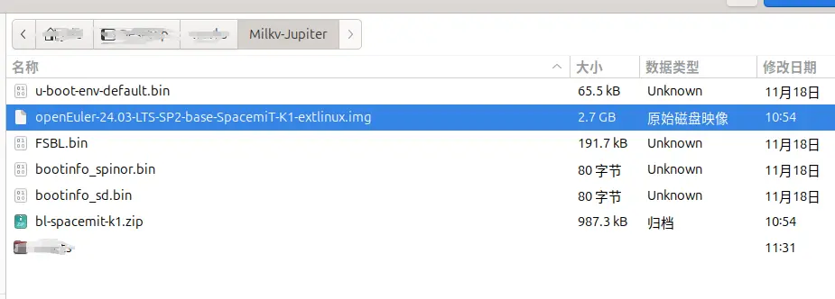
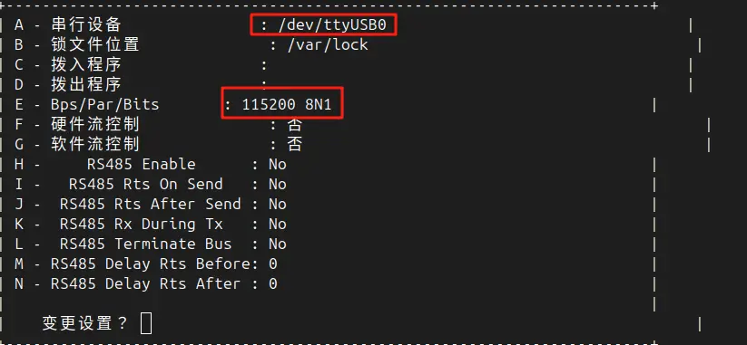

## 手动安装固件和镜像

### 1.1 硬件准备

- Milkv Jupiter 单板计算机

- USB Type-C 数据线缆

- 一台能够运行 Windows, macOS 或 Linux 发行版的电脑

- 串口适配器(可选但建议, 方便调试)

- 支持接口

    - TF 卡(用 SD 卡的方式烧录需要用, 目前只支持)

### 1.2 软件准备

- 串口工具(可选但是建议, 方便调试), 比如 Linux 下的 minicom.

- fastboot 烧录工具

## 2 烧录准备

## 3 固件烧录

### 3.1 烧录镜像到 SD 卡

使用烧录工具, 这里推荐 `balenaEtcher`, Windows 上可以使用 `Win32DiskImager`.

先下载 `openEuler-24.03-LTS-SP2-base-SpacemiT-K1-extlinux.img.zst` 镜像.



等待 flash 完成.


### 3.2 烧录到 EMMC/SSD

按住 Recovery 按键, 之后上电, 之后即可松开.


```bash
# 执行 fastboot devices, 出现选项则说明进入了 USB 烧录模式
# 如果失败这里不会有任何选项.
$ fastboot devices
dfu-device	 DFU download
```

之后解压固件包.

```bash
$ unzip bl-spacemit-k1.zip 
Archive:  bl-spacemit-k1.zip
  inflating: FSBL.bin                
  inflating: bootinfo_sd.bin         
  inflating: bootinfo_spinor.bin     
  inflating: fw_dynamic.itb          
  inflating: partition-mtd.json      
  inflating: partition-sdmmc.json    
  inflating: u-boot-env-default.bin  
  inflating: u-boot.itb          
```

在同一目录下, 依次执行.

```bash
fastboot stage FSBL.bin
fastboot continue
sleep 1
fastboot stage u-boot.itb
fastboot continue
sleep 1
fastboot flash mtd partition-mtd.json
fastboot flash mtd-bootinfo bootinfo_spinor.bin
fastboot flash mtd-fsbl FSBL.bin
fastboot flash mtd-opensbi fw_dynamic.itb
fastboot flash mtd-uboot u-boot.itb
fastboot flash mtd-env u-boot-env-default.bin
```

烧录.

```bash
Sending 'FSBL.bin' (187 KB)                        OKAY [  0.032s]
Finished. Total time: 0.040s
Resuming boot                                      OKAY [  0.007s]
Finished. Total time: 0.007s
Sending 'u-boot.itb' (1981 KB)                     OKAY [  0.075s]
Finished. Total time: 0.077s
Resuming boot                                      OKAY [  0.000s]
Finished. Total time: 0.000s
< waiting for any device >
Warning: skip copying mtd image avb footer (mtd partition size: 0, mtd image size: 631).
Sending 'mtd' (0 KB)                               OKAY [  0.010s]
Writing 'mtd'                                      OKAY [  0.104s]
Finished. Total time: 0.204s
Warning: skip copying mtd-bootinfo image avb footer (mtd-bootinfo partition size: 0, mtd-bootinfo image size: 80).
Sending 'mtd-bootinfo' (0 KB)                      OKAY [  0.010s]
Writing 'mtd-bootinfo'                             OKAY [  0.234s]
Finished. Total time: 0.285s
Warning: skip copying mtd-fsbl image avb footer (mtd-fsbl partition size: 0, mtd-fsbl image size: 191712).
Sending 'mtd-fsbl' (187 KB)                        OKAY [  0.027s]
Writing 'mtd-fsbl'                                 OKAY [  0.781s]
Finished. Total time: 0.866s
Warning: skip copying mtd-opensbi image avb footer (mtd-opensbi partition size: 0, mtd-opensbi image size: 136583).
Sending 'mtd-opensbi' (133 KB)                     OKAY [  0.025s]
Writing 'mtd-opensbi'                              OKAY [  0.709s]
Finished. Total time: 0.794s
Warning: skip copying mtd-uboot image avb footer (mtd-uboot partition size: 0, mtd-uboot image size: 2029462).
Sending 'mtd-uboot' (1981 KB)                      OKAY [  0.122s]
Writing 'mtd-uboot'                                OKAY [  5.718s]
Finished. Total time: 5.898s
Warning: skip copying mtd-env image avb footer (mtd-env partition size: 0, mtd-env image size: 65536).
Sending 'mtd-env' (64 KB)                          OKAY [  0.021s]
Writing 'mtd-env'                                  OKAY [  0.128s]
Finished. Total time: 0.207s
```

此时固件被正确地刷写.

## 4 启动

### 4.1 串口启动

> 暂时支持 SD 卡, 请提前进行 3.1 环节, 并将 SD 卡插入到卡槽中.

```bash
# 进入之后可能需要设置一下波特率, ctrl + A + Z
minicom
```

波特率设置如下.



默认账号: `root`

默认密码: `openEuler!@#$`

