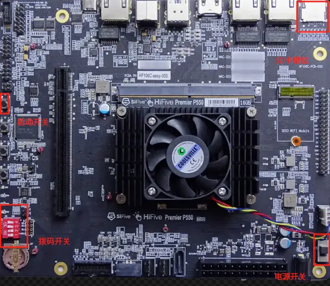
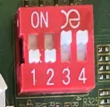
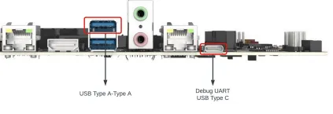
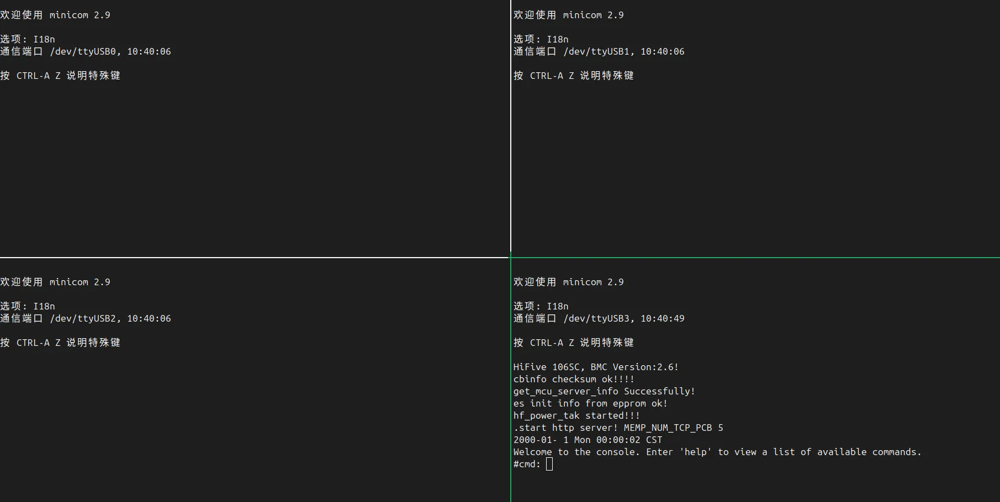
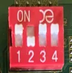

# 在 Sifive HiFive Premier P550 上部署 openEuler RISC-V

## 1 固件烧录

硬件准备:

- Type A to Type A 的线 x1

- Type C 的线(另一端需要插入电脑) x1

- DC 电源适配器 x1

- P550 开发板 x1


软件准备:

- 串口工具, linux 下推荐 `minicom`

- fastboot 工具

### 1.1 操作流程

首先下载固件的压缩包.

```bash
$ unzip firmware-hifive_premier_p550.zip
Archive:  firmware-hifive_premier_p550.zip
  inflating: bootloader-hifive_premier_p550.bin  
```

开发板的关键按钮示意图如下.



将开关拨到如图位置.



插上相关的接口, 其中上述准备好的两条线分别都接入电脑上, 另外插入准备好的电源线.



现在打开四个串口, 现在启动信息将会从其中一个串口弹出, 一开始没有信息, 当拨动电源按钮时会有一个串口打印出信息.



此时按下启动按钮, 会有一个 USB 设备弹出, 此时我们将下载好的固件拷贝过去(不要直接移动过去, 稍后还会用到此固件).

比如 linux 下我直接拷贝过去 `cp -ar bootloader-hifive_premier_p550.bin <PATH>/ESWIN-2030`

进入之后在 uboot 中输入.

```bash
# 此处地址自己定义, 稍后固件会被传送到这个地址.
fastboot -l <地址> usb 0
```

会卡住.

此时在电脑端输入.

```bash
fastboot devices
```

检测到设备则为成功, 之后使用指令.

```bash
$ sudo fastboot stage bootloader-hifive_premier_p550.bin
Sending 'bootloader-hifive_premier_p550.bin' (4213 KB) OKAY [  0.074s]
Finished. Total time: 0.083s
```

这里 uboot 中看到下载成功即可, 如果一直卡住, 我们可以直接 `ctrl + C`.

在 uboot 我们继续执行.

```bash
# 与上面的地址同步.
es_burn write <地址> flash
```

烧录成功之后, 我们可以拔下 Type A to Type A 的线.

之后将拨码开关拨回 NORMAL 模式, 如图.



此时固件就烧录成功了.

## 2 镜像烧录

准备好 SD 卡, 下载给定的 OE 镜像, 之后使用烧录软件, 比如 `balenaEtcher`.

直接烧录即可.

## 系统启动

将装有镜像的 SD 卡插入卡槽中, 在 NORMAL 模式下拨动电源开关和启动开关即可.

> 可能启动过程中会优先 MMC 中的系统, 我们需要手动切换到 SD 卡中安装的镜像.