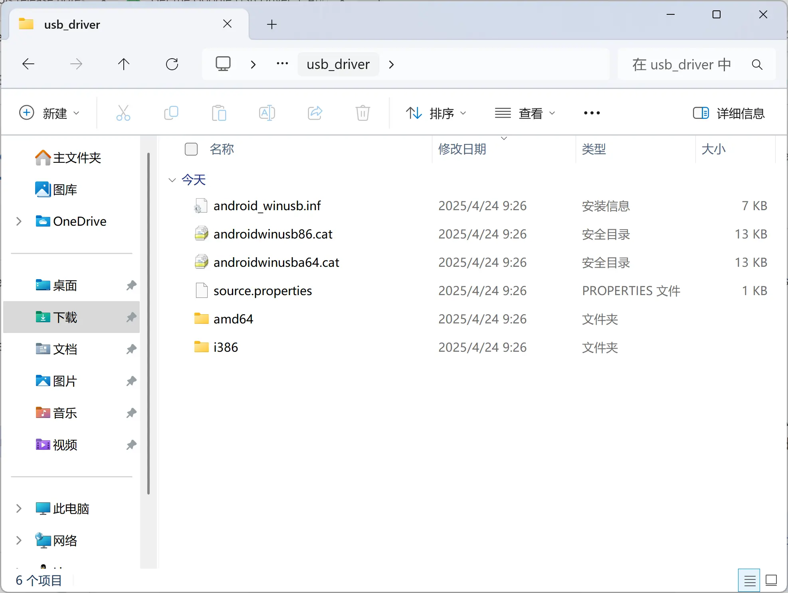
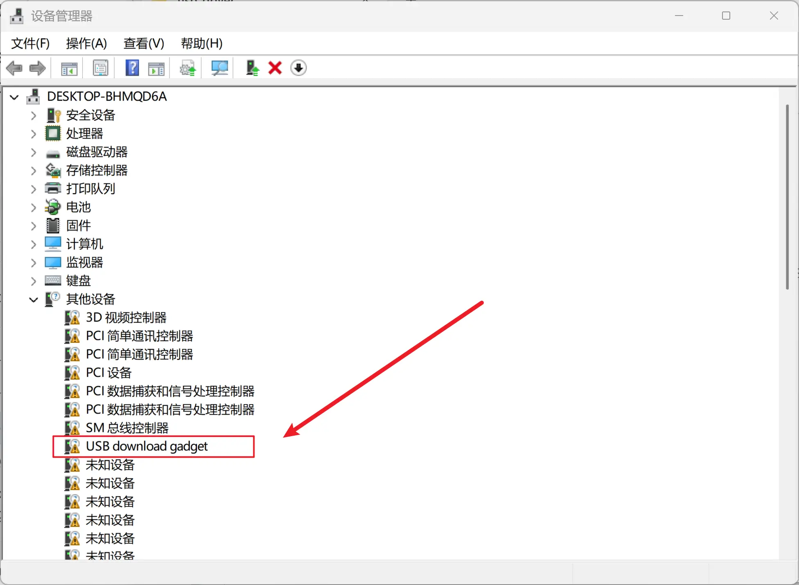
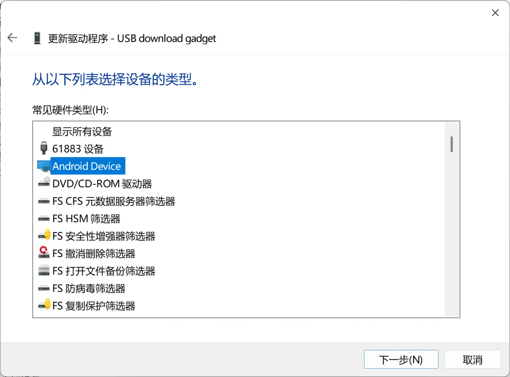
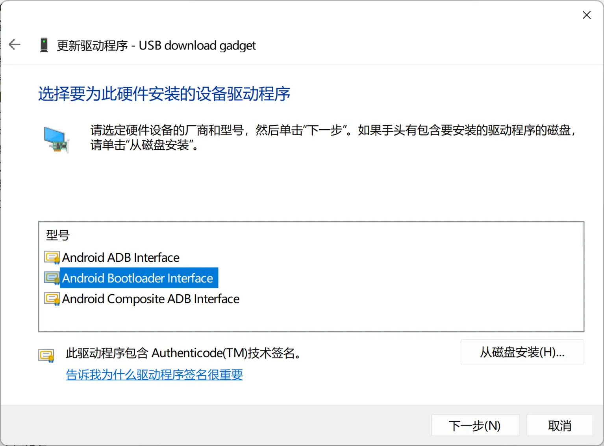

# 参考：fastboot 驱动配置

> 在相同系统下仅需进行一次配置

## Linux

通过 udev 配置设备权限。执行下述命令：

```shell
cat << EOF | sudo tee /etc/udev/rules.d/72-spacemit-k1.rules
SUBSYSTEM=="usb", ATTR{idVendor}=="361c", ATTR{idProduct}=="1001", TAG+="uaccess"
EOF
```

将 SpacemiT K1 使用的 USB IDs 配置为用户可访问。

随后重新插拔连接至设备的 USB 线即可生效。

## macOS

无需特殊配置

## Windows

### 获取 Google USB 驱动

前往 [https://developer.android.com/studio/run/win-usb](https://developer.android.com/studio/run/win-usb) 下载 Google USB Driver。

解压得到下图内容：



### 安装驱动程序

#### 预安装驱动程序至系统

右键解压得到的 `android_winusb.inf`，点击 `安装` 并根据提示操作。

此步骤在同一个 Windows 系统下仅需执行一次。可以支持不同厂商方案的板卡。

#### 连接板卡至 USB 端口

需要将板卡上电，启动至 fastboot 烧写模式，并连接板卡特定的 USB 端口至 PC，使 Windows 枚举到该 USB 设备。

具体的操作细节请参考对应板卡的文档。

#### 手动指定驱动程序

打开设备管理器，在 `其它设备` 中找到 `USB download gadget`。



右键该设备，选择 `更新驱动程序` 。在弹出窗口中选择 `浏览我的电脑以查找驱动程序` 。

点击 `让我从计算机上的可用驱动程序列表中选取` 。

在列表中选中 `Android Device` 后点击下一步：



在本页面中，选中 `Android Bootloader Interface` 后点击下一步：



接受弹出的警告框。完成驱动安装。
