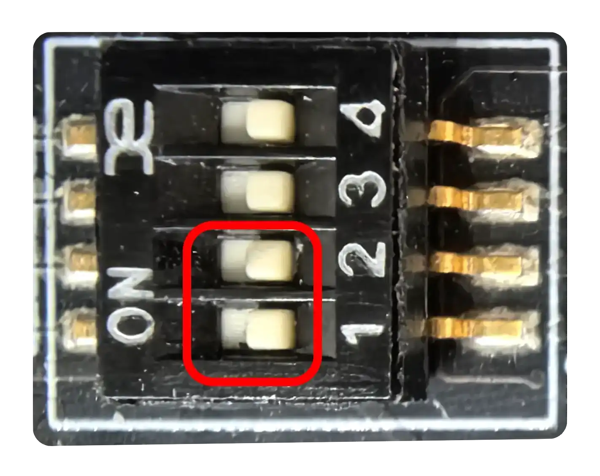
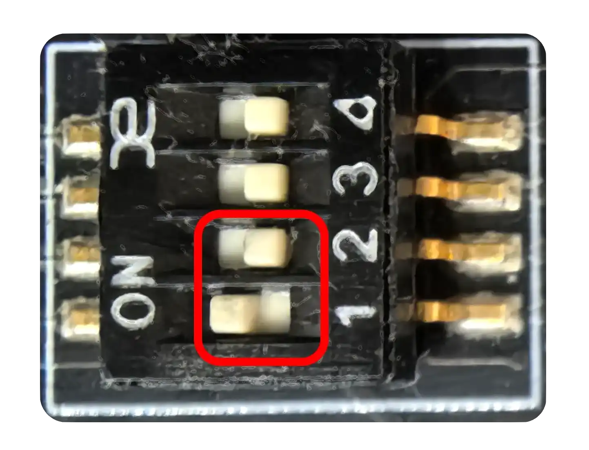

# 参考：物料准备

## 硬件工具

- USB A to A （公对公）数据线
  - 用于固件与系统镜像烧写
  - 反接的 A to C 线材可能不工作
- DC5525 接口的 12V 电源
- 串口适配器
  - 建议使用 3.3V 逻辑电平
  - 监看 Bootloader 的调试输出、选择系统启动项
  - 操作系统默认串口终端
- 计算机
  - 运行 Linux 发行版、macOS 或 Windows
  - 具备足够数量的 USB 2.0 及以上的端口

## 固件加载源配置

固件加载源需要在板卡上电前完成配置。需要打开机箱上盖以操作拨码开关。

### eMMC

将拨码开关拨至如下位置：



### Flash

将拨码开关拨至如下位置：



## 进入 fastboot 烧录模式

需要打开机箱上盖，以便操作按钮并连接 3.3V 调试串口。

位于机器 ID 条形码旁边的按钮为 RST 按钮；位于 M.2 插槽旁边的按钮为 BOOT 按钮。

将板卡背板上靠近底部的白色 USB A 端口通过 Type-A 数据线连接至计算机。

使用 DC 12V 电源为板卡进行供电。

此时板卡已上电并执行正常启动流程。通过下述操作重置板卡并进入 fastboot 模式：

1. 摁住 BOOT 按钮
2. 短摁 RST 按钮
3. 松开 BOOT 按钮

若此时连接了板卡调试串口，则可以观察到如下输出：

```
sys: 0x1000
bm:2
ROM: usb download handler
usb2d_initialize : enter
Controller Run
usb rst int
SETUP: 0x80 0x6 0x100
usb rst int
SETUP: 0x0 0x5 0x24
SETUP: 0x80 0x6 0x100
SETUP: 0x80 0x6 0x200
SETUP: 0x80 0x6 0x200
SETUP: 0x80 0x6 0x300
SETUP: 0x80 0x6 0x302
SETUP: 0x80 0x6 0x301
SETUP: 0x80 0x6 0x30a
SETUP: 0x0 0x9 0x1
usb_rx_bytes : len= 4096 pBuf= 0xc0838720
SETUP: 0x80 0x6 0x302
SETUP: 0x80 0x6 0x304
```
