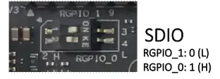
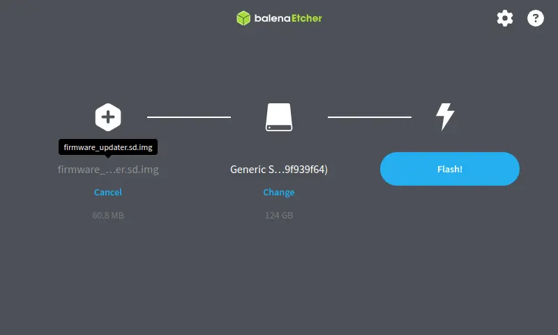
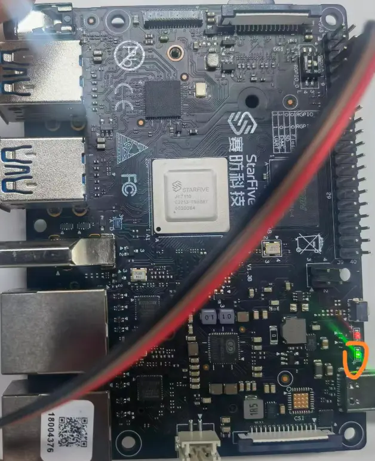
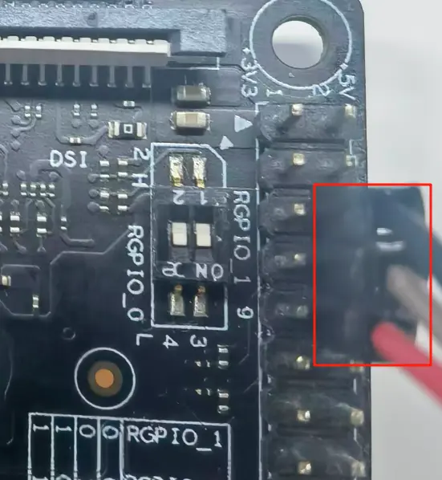
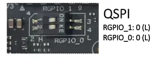
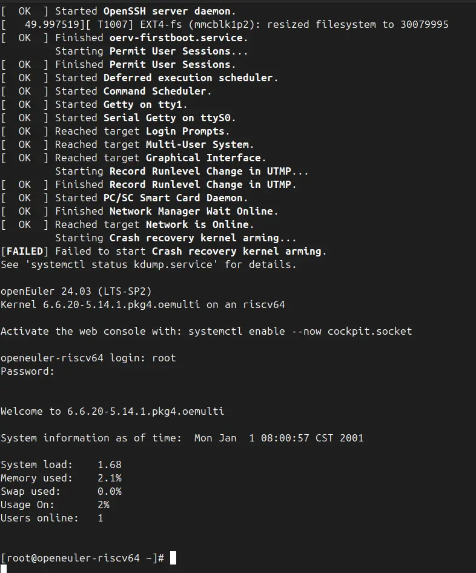

# visionFive2 镜像烧录

## 1 硬件准备

- visionFive2 单板计算机

- 供电线

- 一台能够运行 Windows, macOS 或 Linux 发行版的电脑

- 串口适配器(可选但建议, 方便调试)

- 支持接口

    - TF 卡(用 SD 卡的方式烧录需要用, 目前只支持)


## 2 软件准备

- 串口工具(可选但是建议, 方便调试), 比如 Linux 下的 minicom.

- balenaEtcher 等烧录工具

下载本页面提供的镜像, 系统镜像和固件镜像.

其中固件镜像我们只需要解压的 `img` 镜像即可.

```bash
$ unzip firmware-starfive-jh7110.zip 
Archive:  firmware-starfive-jh7110.zip
  inflating: firmware_updater.sd.img # 固件  
  inflating: u-boot-spl.bin.normal.out  
  inflating: u-boot-env-default.bin  
  inflating: u-boot.itb   
```

## 3 烧录

### 3.1 固件烧录

将按钮切换至如图, 为 SD 卡启动.



其他模式如下.

|index | 启动模式 | RGPIO_1 | RGPIO_0 |
|---|---|---|---|
| 1 | 1-bit QSPI Nor Flash | 0(L) |	0(L) |
| 2 | SDIO3.0 |	0(L) | 1(H) |
| 3 | eMMC | 1(H) | 0(L) |
| 4 | UART | 1(H) | 1(H) |

然后开始烧录固件.



之后保持 SD 卡启动上电, 图中的圈会闪烁3次, 之后保持常亮.



常亮之后, 我们可以接入串口工具(比如 `minicom`)尝试启查看动的信息. 串口的接入从上到下依次为`TX`, `RX`, `GND`.



启动信息如下, 这个时候我们还没有镜像, 因此无法成功.

```bash
Loading Boot0000 'mmc 1' failed
EFI boot manager: Cannot load any image
Boot failed (err=-14)
Card did not respond to voltage select! : -110
** Booting bootflow 'mmc@16020000.bootdev.part_3' with script
## Resetting to default environment
SF: Detected gd25lq128 with page size 256 Bytes, erase size 4 KiB, total 16 MiB
switch to partitions #0, OK
mmc1 is current device
151799 bytes read in 8 ms (18.1 MiB/s)
65536 bytes read in 5 ms (12.5 MiB/s)
1292705 bytes read in 56 ms (22 MiB/s)
device 0 offset 0x0, size 0x400000
0 bytes written, 4194304 bytes skipped in 0.730s, speed 4194304 B/s
```

### 3.2 系统烧录

解压系统镜像.

```bash
$ unzstd openEuler-24.03-LTS-SP2-base-StarFive-JH7110-extlinux.img.zst 
openEuler-24.03-LTS-SP2-base-StarFive-JH7110-extlinux.img.zst: 3597792256 bytes 
```

同 3.1 烧录固件的方式烧录系统镜像.

### 3.3 启动

在完成 3.1 和 3.2 之后将启动模式切换回 flash 模式, 开始系统的启动



启动!!!

默认账户: `root`

默认密码: `openEuler12#$`

